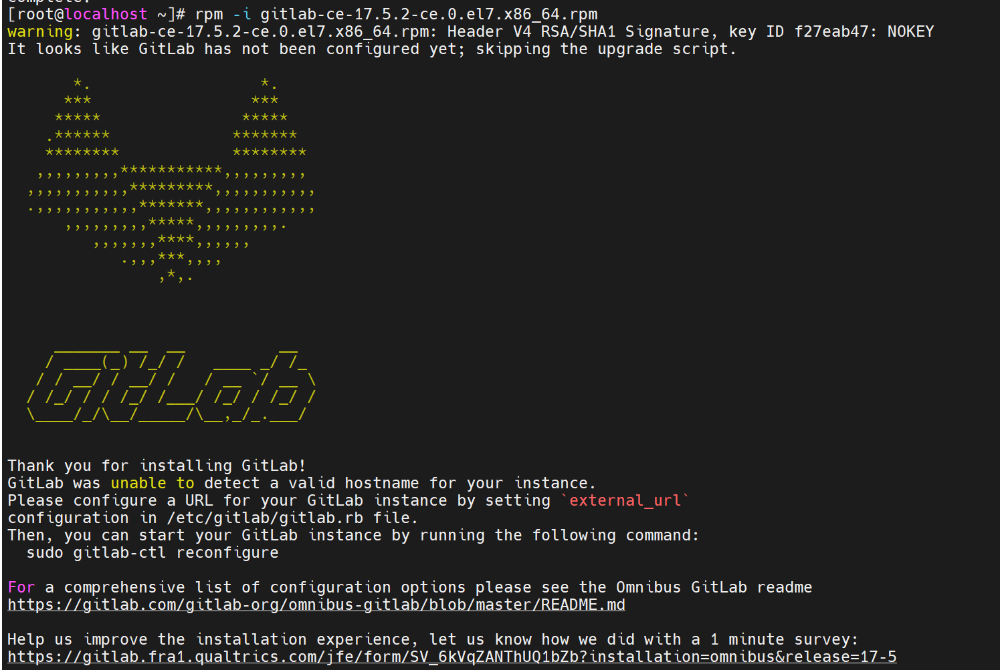

# Gitlab调优配置

> 配置文件所在位置：/etc/gitlab/gitlab.rb
> 默认配置：gitlab.rb
> 调优配置：gitlab.optimize.rb（这个一定要改成gitlab.rb，不要问，没有用不要找我）

## 安装部署

> [前去下载](https://packages.gitlab.com/gitlab/gitlab-ce/el/7/x86_64/Packages/g/)

```shell
curl -O https://packages.gitlab.com/gitlab/gitlab-ce/el/7/x86_64/Packages/g/gitlab-ce-17.5.2-ce.0.el7.x86_64.rpm
yum install policycoreutils-python -y
rpm -ivh gitlab-ce-17.5.2-ce.0.el7.x86_64.rpm
```
#### 出现狐狸图标即可


#### 替换配置，修改为你需要的后，执行命令
```shell
gitlab-ctl reconfigure
gitlab-ctl restart
```

#### 首次安装，root密码所在
```shell
cat /etc/gitlab/initial_root_password
```

#### 默认配置服务清单
```text
[root@localhost gitlab]# gitlab-ctl restart
ok: run: alertmanager: (pid 49347) 0s
ok: run: gitaly: (pid 49355) 1s
ok: run: gitlab-exporter: (pid 49377) 0s
ok: run: gitlab-kas: (pid 49392) 1s
ok: run: gitlab-workhorse: (pid 49400) 0s
ok: run: logrotate: (pid 49414) 0s
ok: run: nginx: (pid 49420) 1s
ok: run: node-exporter: (pid 49439) 0s
ok: run: postgres-exporter: (pid 49444) 1s
ok: run: postgresql: (pid 49456) 0s
ok: run: prometheus: (pid 49472) 1s
ok: run: puma: (pid 49480) 0s
ok: run: redis: (pid 49498) 0s
ok: run: redis-exporter: (pid 49505) 1s
ok: run: sidekiq: (pid 49519) 0s
```
#### 调优配置服务清单
```text
[root@localhost gitlab]# gitlab-ctl restart
ok: run: alertmanager: (pid 49347) 0s
ok: run: gitaly: (pid 49355) 1s
ok: run: gitlab-exporter: (pid 49377) 0s
ok: run: gitlab-kas: (pid 49392) 1s
ok: run: gitlab-workhorse: (pid 49400) 0s
ok: run: logrotate: (pid 49414) 0s
ok: run: nginx: (pid 49420) 1s
ok: run: node-exporter: (pid 49439) 0s
ok: run: postgres-exporter: (pid 49444) 1s
ok: run: postgresql: (pid 49456) 0s
ok: run: prometheus: (pid 49472) 1s
ok: run: puma: (pid 49480) 0s
ok: run: redis: (pid 49498) 0s
ok: run: redis-exporter: (pid 49505) 1s
ok: run: sidekiq: (pid 49519) 0s
```
