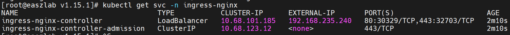

# 集群Nginx代理(7层负载)

> 版本选择参考官方文档 https://kubernetes.github.io/ingress-nginx/

# 开源地址

https://github.com/kubernetes/ingress-nginx

# 版本选择

| 你的 Kubernetes 版本  | 推荐的 Ingress-Nginx 版本 (≥) | 关键原因与限制说明                                                                                            |
|:------------------|:-------------------------|:-----------------------------------------------------------------------------------------------------|
| **v1.27 及以上**     | **v1.14.1+**             | 这是社区明确声明支持的主流版本区间。新版本通常包含安全漏洞修复，建议采用最新稳定版。                                                           |
| **v1.25 及以上**     | **v1.10.4 / v1.11.5**    | 兼容性稳定。需要注意的是，从这些版本开始，社区默认关闭了 `allowSnippetAnnotations`，升级时需要关注。                                      |
| **v1.22 及以上**     | **v1.1.3 或 v1.10+**      | **关键分水岭**：K8s v1.22 移除了 `extensions/v1beta1` 版本的 Ingress API。如果控制器版本低于 **v1.1.3**，将无法解析新格式，导致路由规则失效。 |
| **v1.19 - v1.25** | **v1.10.x 及以下**          | 这是一个比较平稳的兼容区间，大部分版本都能正常工作。                                                                           |
| **v1.13 - v1.18** | **v0.49.x 及以下**          | 这是较老版本的兼容区间。如果你使用的是 0.x 版本，建议尽快规划升级，避免安全风险。                                                          |

> 以下表为准

| Ingress-NGINX 版本 | 支持的 Kubernetes 版本 | Helm Chart 版本 |
|:-----------------|:------------------|:--------------|
| **v1.15.x**      | 1.28 - 1.34+      | 4.15.x        |
| **v1.14.x**      | 1.28 - 1.33       | 4.14.x        |
| **v1.13.x**      | 1.29 - 1.33       | 4.13.x        |
| **v1.12.x**      | 1.28 - 1.32       | 4.12.x        |
| **v1.11.x**      | 1.26 - 1.30       | 4.11.x        |

# 安装脚本

> https://raw.githubusercontent.com/kubernetes/ingress-nginx/controller-v1.15.1/deploy/static/provider/cloud/deploy.yaml

```shell
# dockerhub
kubectl apply -f deploy.yml

# 阿里云
kubectl apply -f deploy.cn.yml

# 阿里云 && 本地网络 && 测试学习使用
# 启用hostNetwork, 将域名解析到任意节点（因为ingress-nginx是daemonset）就可以访问对应的pod服务
kubectl apply -f deploy.cn.hostNetwork.yaml

# 查看命名空间
kubectl get ns | grep ingress-nginx

# 查看 Pod
kubectl get pods -n ingress-nginx -o wide

# 查看 Service
kubectl get svc -n ingress-nginx
```



# deploy.cn 和 deploy.cn.hostNetwork 的区别

- deploy.cn endpoint为内网IP，如果安装了metal-lb，EXTERNAL-IP 应为 metal-lb 分配的宿主机所在区域的ip地址，如上图所示

```text
# kubectl describe svc xx

Endpoints: 172.20.65.95:80
Endpoints: 172.20.65.95:443
```

- deploy.cn.hostNetwork endpoint为宿主机IP

```text
# kubectl describe svc xx

Endpoints: 192.168.235.101:80
Endpoints: 192.168.235.101:443
```
