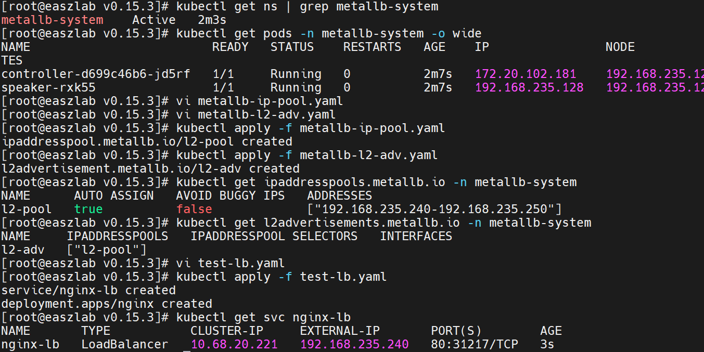

# 裸金属 K8s 集群的 LoadBalancer 实现

自建集群、非云环境推荐使用，不推荐使用hostNetwork

> 官方文档 https://metallb.io/installation/

# 开源地址

https://github.com/metallb/metallb

# 安装步骤

## 一、前置条件

- K8s 版本 ≥ 1.13
- 集群网络插件（Calico/Flannel 等）正常
- 节点间网络互通，预留一段同网段、未占用的静态 IP（如 192.168.235.240-192.168.235.250）
- 关闭 kube-proxy 的 strictARP（非常关键）

#### kube-proxy 存在的情况

```shell
kubectl edit configmap kube-proxy -n kube-system
# 找到并修改：
# strictARP: false  →  strictARP: true
# mode: "" → mode: "ipvs"
kubectl rollout restart daemonset kube-proxy -n kube-system
```

#### kube-proxy 不存在的情况（本地私有化的k8s集群，就是自建的集群，非云上集群，我这边是单节点私有集群，也就是只有一个master）

> 在每个节点上执行

```shell
cat /var/lib/kube-proxy/kube-proxy-config.yaml
vi /var/lib/kube-proxy/kube-proxy-config.yaml
```

> 确保以下配置生效

```yaml
kind: KubeProxyConfiguration
apiVersion: kubeproxy.config.k8s.io/v1alpha1
mode: "ipvs"
ipvs:
  strictARP: True
```

> 重启kube-proxy

```shell
sudo systemctl restart kube-proxy
```

> 执行命令命令

```shell
# 查看进程，确认重启成功
ps -ef | grep kube-proxy

# 检查新的配置是否加载（查看日志）
sudo journalctl -u kube-proxy -n 20
```

> 验证 strictARP 是否生效

```shell
# 通过 kube-proxy 的 API 查看配置（默认监听 10249 端口）
curl 127.0.0.1:10249/configz
```

## 二、安装 MetalLB

> https://raw.githubusercontent.com/metallb/metallb/v0.15.3/config/manifests/metallb-native.yaml

```shell
kubectl apply -f metallb-native.cn.yaml
```

## 三、验证安装

```shell
# 查看命名空间
kubectl get ns | grep metallb-system

# 查看 Pod（controller 1个，speaker 每个节点1个）
kubectl get pods -n metallb-system -o wide
```

## 四、配置 IP 池与 Layer2 宣告

1. 创建 IPAddressPool（IP 池）-> metallb-ip-pool.yaml

```yaml
apiVersion: metallb.io/v1beta1
kind: IPAddressPool
metadata:
  name: l2-pool
  namespace: metallb-system
spec:
  addresses:
    - 192.168.235.240-192.168.235.250  # 改为你的网段
```

2. 创建 L2Advertisement（Layer2 宣告）-> metallb-l2-adv.yaml

```yaml
apiVersion: metallb.io/v1beta1
kind: L2Advertisement
metadata:
  name: l2-adv
  namespace: metallb-system
spec:
  ipAddressPools:
    - l2-pool  # 关联上面的 IP 池 
```

3. 应用配置

```shell
kubectl apply -f metallb-ip-pool.yaml
kubectl apply -f metallb-l2-adv.yaml

# 查看配置
kubectl get ipaddresspools.metallb.io -n metallb-system
kubectl get l2advertisements.metallb.io -n metallb-system
```

## 五、创建 LoadBalancer 服务（测试）-> test-lb.yaml

```yaml
apiVersion: v1
kind: Service
metadata:
  name: nginx-lb
spec:
  type: LoadBalancer
  selector:
    app: nginx
  ports:
    - port: 80
      targetPort: 80
---
apiVersion: apps/v1
kind: Deployment
metadata:
  name: nginx
spec:
  replicas: 1
  selector:
    matchLabels:
      app: nginx
  template:
    metadata:
      labels:
        app: nginx
    spec:
      containers:
        - name: nginx
          image: registry.cn-shanghai.aliyuncs.com/odboy/kenaito-cicd:nginx-alpine
```

```shell
kubectl apply -f test-lb.yaml

# 查看服务（EXTERNAL-IP 应分配到 IP 池中的 IP）
kubectl get svc nginx-lb
# 访问测试：curl http://<EXTERNAL-IP>
```



## 六、常见问题

- EXTERNAL-IP 一直 Pending

```text
检查 IP 池网段是否与节点同网段、未占用
确认 kube-proxy 的 strictARP=true 且已重启
查看 speaker 日志：kubectl logs -n metallb-system <speaker-pod>
```
