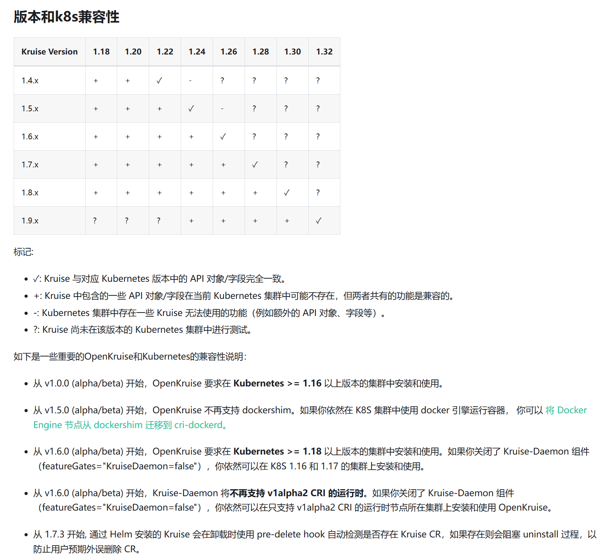

# Kubernetes 的扩展套件，主要聚焦于云原生应用的自动化，比如部署、发布、运维以及可用性防护

> 官方文档 https://openkruise.io/zh/docs/installation

# 开源地址

https://github.com/openkruise/kruise

# 版本选择



# chart包选择

- kruise-{version}.tgz dockerhub版
- kruise-{version}.cn.tgz 国内版

# 安装脚本

```shell
# 安装（需要一段时间才能生效，大概5~10分钟，使用kubectl get，然后tab键，就能看到对应的快捷提示了）默认是containerd
helm install kruise kruise-1.7.5.cn.tgz
# 如果运行时是docker
helm install kruise kruise-1.7.5.cn.tgz --namespace kruise-system --create-namespace --set daemon.socketPath=/var/run/docker.sock
# 如果运行时是containerd
helm install kruise kruise-1.7.5.cn.tgz --namespace kruise-system --create-namespace --set daemon.socketPath=/run/containerd/containerd.sock

# 升级
helm upgrade kruise kruise-1.8.3.cn.tgz
```

# 验证是否生效（以下是测试流程）
```shell
[root@easzlab kruise-v1.7.5]# kubectl get pods -n kruise-system
NAME                                        READY   STATUS    RESTARTS        AGE
kruise-controller-manager-5d58bcb6c-97k9l   1/1     Running   1 (3m29s ago)   5m38s
kruise-controller-manager-5d58bcb6c-gn25c   1/1     Running   1 (3m29s ago)   5m38s
kruise-daemon-pr5p2                         1/1     Running   1 (3m29s ago)   5m38s

[root@easzlab kruise-v1.7.5]# helm list
NAME    NAMESPACE       REVISION        UPDATED                                 STATUS          CHART           APP VERSION
kruise  default         1               2026-04-18 09:19:42.992859098 +0800 CST deployed        kruise-1.7.5    1.7.5

[root@easzlab kruise-v1.7.5]# kubectl get crd clonesets.apps.kruise.io
NAME                       CREATED AT
clonesets.apps.kruise.io   2026-04-18T01:19:43Z

[root@easzlab kruise-v1.7.5]# kubectl get crd | grep kruise.io
advancedcronjobs.apps.kruise.io            2026-04-18T01:19:43Z
broadcastjobs.apps.kruise.io               2026-04-18T01:19:43Z
clonesets.apps.kruise.io                   2026-04-18T01:19:43Z
containerrecreaterequests.apps.kruise.io   2026-04-18T01:19:43Z
daemonsets.apps.kruise.io                  2026-04-18T01:19:43Z
imagelistpulljobs.apps.kruise.io           2026-04-18T01:19:43Z
imagepulljobs.apps.kruise.io               2026-04-18T01:19:43Z
nodeimages.apps.kruise.io                  2026-04-18T01:19:43Z
nodepodprobes.apps.kruise.io               2026-04-18T01:19:43Z
persistentpodstates.apps.kruise.io         2026-04-18T01:19:43Z
podprobemarkers.apps.kruise.io             2026-04-18T01:19:43Z
podunavailablebudgets.policy.kruise.io     2026-04-18T01:19:43Z
resourcedistributions.apps.kruise.io       2026-04-18T01:19:43Z
sidecarsets.apps.kruise.io                 2026-04-18T01:19:43Z
statefulsets.apps.kruise.io                2026-04-18T01:19:43Z
uniteddeployments.apps.kruise.io           2026-04-18T01:19:43Z
workloadspreads.apps.kruise.io             2026-04-18T01:19:43Z
```

# 强制卸载kruise
```shell
kubectl delete job -n kruise-system kruise-finalizer --force --grace-period=0
kubectl delete namespace kruise-system --force --grace-period=0
kubectl get crd | grep kruise | awk '{print $1}' | xargs kubectl delete crd
kubectl delete validatingwebhookconfiguration -l app=kruise --ignore-not-found
kubectl delete validatingwebhookconfiguration kruise-validating-webhook-configuration
kubectl delete namespace kruise-daemon-config
kubectl delete mutatingwebhookconfiguration -l app=kruise --ignore-not-found
kubectl delete secret -n default sh.helm.release.v1.kruise.v1
kubectl delete mutatingwebhookconfiguration kruise-mutating-webhook-configuration
kubectl delete validatingwebhookconfiguration kruise-validating-webhook-configuration --ignore-not-found
kubectl delete all -n default -l app=kruise --ignore-not-found
kubectl delete all -n default -l control-plane=controller-manager --ignore-not-found
kubectl delete daemonset -n default kruise-daemon --ignore-not-found
kubectl delete deployment -n default kruise-controller-manager --ignore-not-found
kubectl delete service -n default kruise-webhook-service --ignore-not-found
kubectl delete secret -n default sh.helm.release.v1.kruise.v1 --ignore-not-found
kubectl delete secret -n kruise-system -l "owner=helm" --ignore-not-found
kubectl delete namespace kruise-system --force --grace-period=0
kubectl get clusterrole | grep kruise | awk '{print $1}' | xargs kubectl delete clusterrole
kubectl get clusterrolebinding | grep kruise | awk '{print $1}' | xargs kubectl delete clusterrolebinding

# 检查所有命名空间
kubectl get ns | grep -E "kruise"
# 检查 CRD
kubectl get crd | grep kruise
# 检查 webhook
kubectl get validatingwebhookconfiguration,mutatingwebhookconfiguration | grep kruise
# 检查 RBAC
kubectl get clusterrole,clusterrolebinding | grep kruise
# 检查所有 API 资源
kubectl api-resources | grep kruise
```
